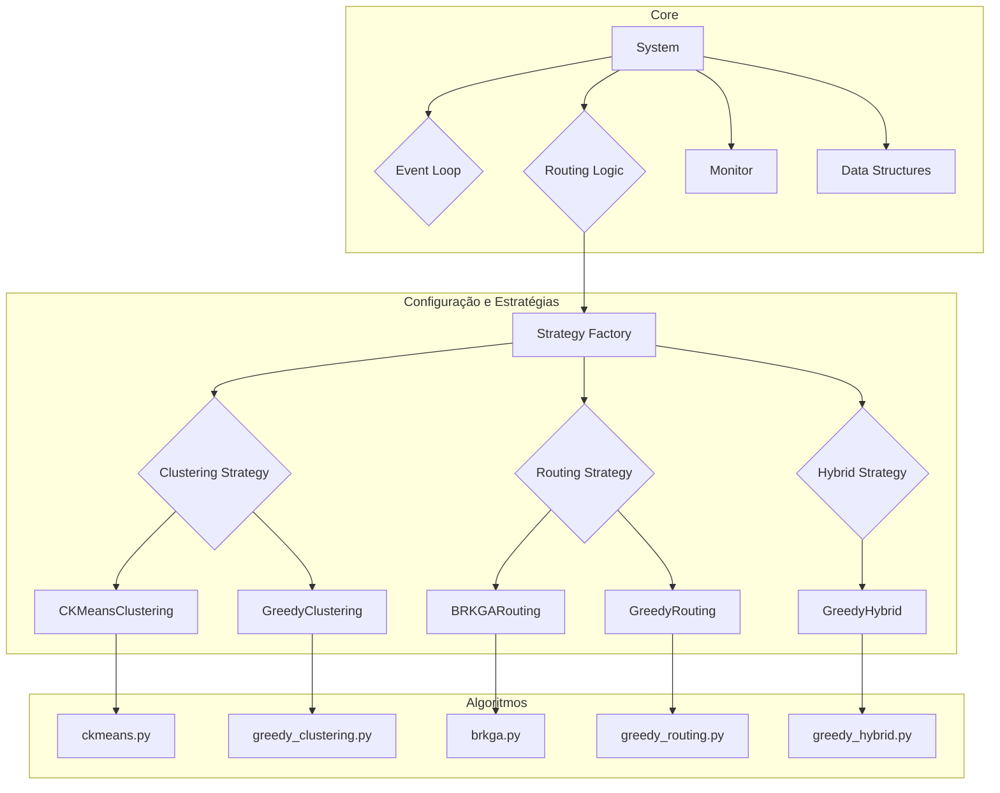

# Documentação Técnica do Módulo de Serviço

## 1. Visão Geral do Projeto

Este projeto implementa um sistema de simulação para otimização de rotas de entrega em tempo real, projetado para resolver o Problema de Roteamento de Entregas de Refeições em Tempo Real (do inglês, *Real-Time Meal Delivery Routing Problem* - RTMRDP). O núcleo do sistema, localizado no diretório `service`, é responsável por receber pedidos de entrega, agrupá-los (clusterização), definir as melhores rotas para uma frota de veículos (roteirização) e simular o processo de despacho e entrega.

O objetivo principal é minimizar os custos operacionais, que são representados por uma combinação de tempo total de rota e penalidades por atraso na entrega. O sistema é flexível, permitindo a seleção de diferentes algoritmos de clusterização e roteirização através de um arquivo de configuração, facilitando a comparação de estratégias. Além das abordagens em duas etapas (clusterização e depois roteirização), o sistema também suporta **estratégias híbridas** que resolvem ambos os problemas simultaneamente.

## 2. Arquitetura e Componentes

A arquitetura do módulo `service` é modular e baseada em estratégias (Strategy Pattern), o que permite trocar os algoritmos de otimização facilmente. A interação entre os componentes é orquestrada pela classe `System`, que gerencia o tempo da simulação, os eventos e o estado dos pedidos e veículos.

### Diagrama de Componentes



### Principais Módulos

-   **`system.py`**: O coração do simulador. A classe `System` gerencia a fila de eventos (usando `heapq`), o tempo da simulação, o estado dos pedidos e veículos. Ela orquestra a lógica de roteirização, chamando as estratégias de otimização escolhidas.
-   **`strategies.py`**: Define as interfaces abstratas (`ClusteringStrategy`, `RoutingStrategy`, `HybridStrategy`) e implementa as classes concretas que encapsulam os diferentes algoritmos.
-   **`factory.py`**: Implementa a função `get_strategies`, que atua como uma fábrica para criar e retornar as instâncias das estratégias corretas com base na configuração da simulação (`SimulationConfig`).
-   **`config.py`**: Centraliza as configurações da simulação. Define `Enums` para os algoritmos disponíveis (`ClusteringAlgorithm`, `RoutingAlgorithm`, `HybridAlgorithm`) e um `dataclass` (`SimulationConfig`) para manter a configuração atual.
-   **`structures.py`**: Contém as estruturas de dados fundamentais do projeto, como `Delivery`, `Vehicle`, `Point` e `Event`, definidas como `dataclasses` para clareza e robustez.
-   **`helpers.py`**: Fornece funções utilitárias, principalmente `evaluate_sequence`, que é a função de avaliação (fitness) usada pelos algoritmos de roteirização para calcular a qualidade de uma rota (penalidades e tempo).
-   **`distances.py`**: Funções para calcular matrizes de distância e tempo entre pontos geográficos.
-   **`monitor.py`**: Classe para coletar e exibir métricas de desempenho da simulação.
-   **Algoritmos**:
    -   `clustering/ckmeans.py`: K-Means com restrição de capacidade via Programação Inteira Mista (MIP).
    -   `heuristics/greedy_clustering.py`: Heurística gulosa sequencial para clusterização.
    -   `metaheuristics/brkga.py`: Meta-heurística BRKGA para roteirização.
    -   `heuristics/greedy_routing.py`: Heurística de "Inserção Mais Barata" para roteirização de um cluster.
    -   `heuristics/greedy_hybrid.py`: Heurística de "Inserção Gulosa Global" que combina clusterização e roteirização.

## 3. Explicação Detalhada do Código

### `system.py` - O Orquestrador da Simulação

A classe `System` é o ponto central.

-   **`routing_decision_logic()`**: Esta é a função que decide quando e como otimizar as rotas.
    1.  Coleta os pedidos prontos (`OrderStatus.READY`) e os veículos disponíveis (`VehicleStatus.IDLE`).
    2.  Verifica se uma estratégia híbrida está configurada. Se sim, chama `self.hybrid_strategy.generate_solution(...)` para obter a solução completa (atribuição e rotas) em uma única etapa.
    3.  Caso contrário, executa a abordagem de duas etapas: primeiro chama a estratégia de clusterização (`self.clustering_strategy.cluster(...)`) e depois a de roteirização (`self.routing_strategy.generate_routes(...)`).
    4.  Aplica uma política de despacho (ASAP ou JIT) e atualiza o estado do sistema.

### `strategies.py` e `factory.py` - Padrão Strategy

-   `ClusteringStrategy`, `RoutingStrategy` e `HybridStrategy` são classes base abstratas que definem as interfaces para os algoritmos.
-   As classes concretas (`CKMeansClustering`, `GreedyHybrid`, etc.) implementam a lógica específica de cada algoritmo.
-   A função `get_strategies` em `factory.py` desacopla o `System` da criação das instâncias de estratégia.

### `heuristics/greedy_hybrid.py` - Heurística de Inserção Gulosa Global (Greedy Insertion)

Este módulo implementa a `GreedyHybridStrategy`, uma abordagem que combina clusterização e roteirização em uma única fase. Diferente das estratégias de duas etapas, ela não separa os problemas, tomando decisões de forma global.

-   **`generate_solution(...)`**:
    1.  **Inicialização**: Começa com todos os veículos vazios e uma lista de todos os pedidos prontos para serem alocados.
    2.  **Loop de Inserção Gulosa**: O algoritmo entra em um loop que continua até que todos os pedidos tenham sido atribuídos ou não haja mais inserções válidas.
        -   **Busca Global pela Melhor Inserção**: Em cada iteração do loop, o algoritmo realiza uma busca exaustiva. Ele testa a inserção de **cada** pedido não alocado em **cada** posição possível de **cada** rota de **cada** veículo.
        -   **Cálculo de Custo**: Para cada inserção potencial, ele utiliza a função `evaluate_sequence` para calcular o custo total da nova rota (principalmente a penalidade por atraso). O "custo de inserção" é a diferença entre o custo da nova rota e o custo da rota original.
        -   **Seleção Gulosa**: Após testar todas as combinações, o algoritmo identifica a inserção que resultou no **menor aumento de custo (ou maior redução)** em todo o sistema. Esta é a decisão "gulosa".
    3.  **Aplicação da Melhor Inserção**: O pedido é inserido na rota do veículo e na posição que garantiram o menor custo. A capacidade do veículo é atualizada e o pedido é removido da lista de não alocados.
    4.  **Repetição**: O loop recomeça, buscando a próxima melhor inserção global entre os pedidos restantes. Se nenhuma inserção for possível (ex: por falta de capacidade), o algoritmo termina.

Essa estratégia é "híbrida" porque, ao decidir onde inserir um pedido, ela está simultaneamente escolhendo um cluster (o veículo) e uma posição na rota (roteirização), baseando-se em uma métrica de custo global.

### `metaheuristics/brkga.py` - Otimização Avançada

Este módulo implementa o BRKGA, uma meta-heurística poderosa para problemas de otimização combinatória.

-   **`brkga_for_routing_with_depot(...)`**: A função principal.
    1.  **Inicialização**: Converte os `datetimes` das janelas de tempo em minutos relativos a um timestamp de referência para simplificar os cálculos. Cria uma população inicial de "chaves aleatórias" (vetores de números entre 0 e 1).
    2.  **Decodificação**: A função `decode_keys_to_sequence` transforma um vetor de chaves em uma sequência de visitas, ordenando os pedidos com base nos valores das chaves.
    3.  **Avaliação (Fitness)**: Para cada sequência, a função `evaluate_sequence` (do `helpers.py`) é chamada para calcular a penalidade total e o tempo de rota.
    4.  **Evolução**: O algoritmo evolui por gerações. Em cada geração, a população é dividida em "elite" (as melhores soluções) e "não elite". Novos indivíduos são gerados pelo cruzamento (crossover) entre um pai de elite e um pai não elite, com uma probabilidade (`bias`) de herdar a chave do pai de elite. Uma porção da população é substituída por "mutantes" (soluções totalmente aleatórias) para garantir a diversidade.
    5.  **Busca Local**: Após o término das gerações, a melhor solução encontrada passa por refinamentos usando algoritmos de busca local (`two_opt`, `or_opt`, `relocate`) para tentar melhorá-la ainda mais.
    6.  **Retorno**: A função retorna a melhor sequência encontrada e um dicionário detalhado com os tempos de chegada, penalidades e horários em formato `datetime`.

### `heuristics/greedy_routing.py` - Heurística de Inserção

-   **`cheapest_insertion_heuristic(...)`**: Uma alternativa mais rápida, porém menos ótima, ao BRKGA.
    1.  **Inicialização**: Começa a rota com o ponto mais próximo do depósito.
    2.  **Iteração**: A cada passo, para todos os pedidos ainda não roteirizados, ele calcula o "custo de inserção" em todas as posições possíveis da rota atual. O custo é o aumento no tempo total da rota (`tempo(i, k) + tempo(k, j) - tempo(i, j)`).
    3.  **Seleção**: O pedido com o menor custo de inserção é adicionado à rota na sua melhor posição.
    4.  **Repetição**: O processo se repete até que todos os pedidos estejam na rota.

### `clustering/ckmeans.py` - Clusteração usando K-Means com Capacidade

Este módulo implementa uma versão do K-Means que respeita a restrição de capacidade dos clusters (veículos). É um algoritmo iterativo que alterna entre atribuição de pontos e atualização de centróides.

-   **`capacitated_kmeans(...)`**: A função principal.
    1.  **Inicialização**: Utiliza o K-Means++ padrão (`sklearn.cluster.KMeans`) para encontrar um conjunto inicial de centróides.
    2.  **Loop Iterativo**:
        -   **Etapa de Atribuição**: Esta é a parte crucial. Em vez de simplesmente atribuir cada ponto ao centróide mais próximo (como no K-Means padrão), ele resolve um Problema de Programação Inteira Mista (MIP) através da função `capacitated_assignment_mip`. O MIP garante que a atribuição minimize a distância total aos centróides, sujeito a duas restrições:
            1.  Cada ponto (entrega) deve ser atribuído a exatamente um cluster (veículo).
            2.  A soma dos "pesos" (tamanho dos pedidos) em cada cluster não pode exceder a capacidade do veículo.
        -   **Etapa de Atualização**: Após a atribuição, os centróides de cada cluster são recalculados como a média ponderada (pelo tamanho do pedido) das coordenadas dos pontos que foram atribuídos a ele.
    3.  **Convergência**: O loop continua até que a mudança na posição dos centróides entre iterações seja menor que uma tolerância (`tol`) ou o número máximo de iterações (`max_iters`) seja atingido.

### `heuristics/greedy_clustering.py` - Clusterização Gulosa Sequencial

Implementa uma heurística de clusterização simples e rápida, baseada em uma lógica gulosa.

-   **`sequential_assignment_heuristic(...)`**:
    1.  **Ordenação**: Primeiro, todas as entregas pendentes são ordenadas em ordem **decrescente** de sua distância até o depósito. A intuição é que as entregas mais distantes são mais restritivas e, portanto, devem ser alocadas primeiro para garantir que encontrem um veículo.
    2.  **Atribuição Sequencial**: O algoritmo itera sobre a lista ordenada de entregas. Para cada entrega, ele percorre a lista de veículos disponíveis.
    3.  **Primeiro Encaixe (First Fit)**: A entrega é atribuída ao **primeiro** veículo na lista que possui capacidade restante suficiente para acomodá-la.
    4.  **Finalização**: Uma vez que uma entrega é atribuída, o algoritmo passa para a próxima entrega. Se uma entrega não couber em nenhum veículo, ela é efetivamente ignorada e permanecerá pendente para a próxima rodada de roteirização.

## 4. Casos de Uso / Exemplos

O principal caso de uso é a execução de uma simulação.

```python
# Exemplo de como o sistema seria configurado e executado com a abordagem tradicional
from datetime import datetime
import numpy as np

from service.system import System
from service.config import SimulationConfig, ClusteringAlgorithm, RoutingAlgorithm
from service.structures import Vehicle

config = SimulationConfig(
    clustering_algo=ClusteringAlgorithm.CKMEANS,
    routing_algo=RoutingAlgorithm.BRKGA
)
# ... (resto do setup)
```

```python
# Exemplo de como o sistema seria configurado e executado com uma estratégia HÍBRIDA
from datetime import datetime
import numpy as np

from service.system import System
from service.config import SimulationConfig, HybridAlgorithm
from service.structures import Vehicle

# 1. Definir a configuração da simulação para usar a estratégia híbrida
config = SimulationConfig(
    hybrid_algo=HybridAlgorithm.GREEDY_INSERTION
)

# ... (resto do setup igual ao exemplo anterior)
```

## 5. Instruções de Instalação e Execução

### Pré-requisitos

-   Python 3.9+
-   Pip (gerenciador de pacotes)

### Instalação de Dependências

As dependências do projeto estão listadas implicitamente nos imports. Para instalar todas, execute:

```bash
pip install numpy scipy pulp scikit-learn
```

**Nota:** O `pulp` requer um solver de MIP. O `CBC` é instalado por padrão junto com ele e não requer nenhuma configuração adicional.

### Execução

O módulo `service` foi projetado para ser importado e utilizado por um script principal que orquestra a simulação. Assumindo que você tenha um arquivo `main.py` no diretório raiz do projeto (`project/`) com o código do exemplo da seção 4, você pode executá-lo da seguinte forma:

1.  Navegue até o diretório raiz do projeto no seu terminal.
2.  Execute o script principal:

```bash
python main.py
```

A saída da simulação, incluindo o log de eventos, decisões de roteamento e o painel de monitoramento, será exibida no console.